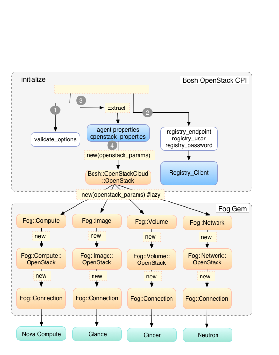
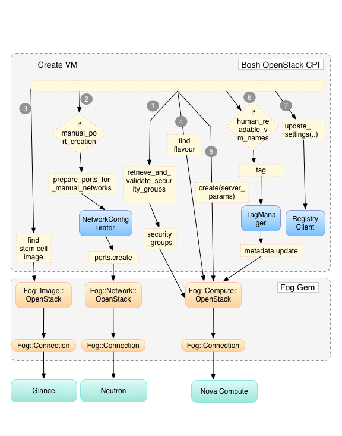
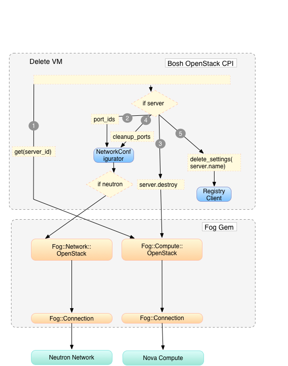

# OpenStack CPI Implementation #
OpenStack CPI is an implementation of BOSH CPI. It allows BOSH to interface with various services in OpenStack like glance, controller and registry. 

The OpenStack CPI is configured in the BOSH deployment manifest. Read the [OpenStack CPI Config docs](bosh_openstack_cpi/cpi_config.md) for more details.

In the sections below we outline the implementation details for each of the method in CPI interface.

## Initialize ##

Implementation of `def initialize(options)` method. 

1. Validate the `options` passed to this method
2. Instantiate `Registry_Client`.
3. Extract required properties from `options` object.
4. Instantiate `Bosh::OpenStackCloud::Openstack` with the provided openstack options. It is a `Fog` wrapper and manages all connections to OpenStack services. Connections are created lazy. First access to a service triggers the connection setup. `Bosh::OpenStackCloud::Openstack` manges the connections to the follwoing services:   
	+ Nova Service
		1. Instantiate `Fog::Compute` instance
		2. `Fog::Compute::OpenStack` instance is created
		3. A New `Fog::Connection` object connects with the remote Nova Compute Service
	+ Glance service
		1.  Instantiate `Fog::Image` instance
 		2.  `Fog::Image::OpenStack` instance is created
		3.  A New `Fog::Connection` object connects with the remote Glance Service
	+ Cinder service
		1.  Instantiate `Fog::Volume` instance
 		2.  `Fog::Volume::OpenStack` instance is created
		3.  A New `Fog::Connection` object connects with the remote Cinder Service
	+ Neutron service
		1.  Instantiate `Fog::Network` instance
 		2.  `Fog::OpenStack::Network` instance is created
		3.  A New `Fog::Connection` object connects with the remote Neutron Service  

	

## Create Stemcell ##

Implementation of method `create_stemcell(image_path, cloud_properties)`
Steps outlined below are the flow control implemented to extract and upload kernel image, ramdisk and stem cell image.

1. Extract parameters from the `cloud_properties`. Check if `kernel_file` parameter exists, instantiate `kernel_image` object
2. Construct `kernel_params`
3. Upload `kernel_image` to glance service by calling the method `upload_image(kernel_params)`
4. If params contain `ramdisk_file` 
5. Instantiate ramdisk_image object and populate `ramdisk_parama`
6. Upload the `ramdisk_image` to glance service by calling `upload(ramdisk_params)`
7. Populate `image_params` for the stem cell to be uploaded to glance service
8. Call the method `upload_image(image_params)` 

Figure below shows the flow control for the method `create_stemcell(image_path, cloud_properties)`

## Delete Stemcell ##

## Create VM ##

Implementation of
`def create_vm(agent_id, stemcell_id, resource_pool, network_spec = nil, disk_locality = nil, environment = nil)` method.

1. Retrieve `security_groups` available on OpenStack and validate them against configured.
2. If option `config_drive` and multiple manual networks are set, create network ports for manual networks.
3. Find stemcell image for passed `stemcell_id`.
4. Find OpenStack flavor for configured `instance_type`.
5. Create VM.
6. If `loadbalancer_pools` are specified, add VM as member to each pool and tag VM with pool and membership ID.
7. If option `human_readable_vm_names` is provided, tag the created VM with it's BOSH registry key.
8. Update BOSH registry settings for the new VM.

## Delete VM ##

Implementation of `delete_vm(server_id)`. This method deletes the VM created in Nova Compute.

1. Get the `server` of the VM to be deleted
2. If Neutron exists, get network port ids for server.
3. Call `server.destroy`. This will send `delete_server` request to Nova Compute.
4. If Neutron exists, delete network ports
5. If VM was tagged with LBaaS pools, remove VM membership from load balancer pools
6. Delete the settings from Registry by calling `delete_settings` method.

Figure below shows the flow control for `delete_vm` method

## Create Disk ##

1. Check if size passed is integer, is greater than 1024 and less than 1024*1000, else throw an error
2. Create `volume_params`
3. Call `create()volume_params)` on `Fog::Compute` service
     1. `create_volume` request on `Fog::Volume::OpenStack` 
     2. Opens a `Fog::Connection` request to access the remote service and create a volume.

Figure below shows the flow control of `create_disk` method

## Delete Disk ##

This method deletes the volume created in OpenStack Nova Volume 

